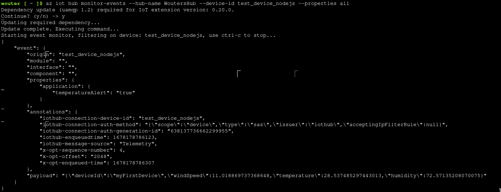
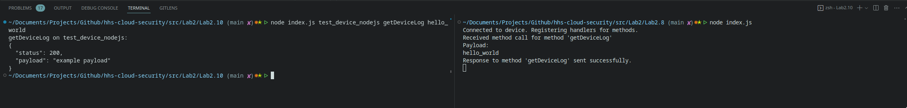

For this lab I used plane JavaScript instead of Typescript.

# Lab 2

**1. Register a device via the GUI or CLI. This will give you a connection string**\
I have registered a new device named "test_device_nodejs" and copied its primary
connection key.

**2. Use the sample code from Git: device/samples/javascript/simple_sample_device.js. This code is simpler than pnp_temperature_controller.js. Don't forget to run npm install for the packages before running the code.**\
I added the `azure-iot-device-mqtt` and `azure-iot-device` packages to the
project and run the index.js file. It connected to the Azure IoT hub and have
the following output on the console:

```bash
Client connected
Sending message: {"deviceId":"myFirstDevice","windSpeed":10.69456762319736,"temperature":23.195702390233432,"humidity":75.48105652986075}
send status: MessageEnqueued
```



**3. Check if messages are arriving at the IoT Hub: Use the CLI command for this. Note this command as well. What information do you receive? And from which device does it come? Is this information consistent?**\
I used the `az iot hub monitor-events --hub-name WoutersHub --device-id test_device_nodejs --properties all` command to get a verbose version of the events matching my test device. The `--properties all` argument adds extra verbose information, containing the temperatureAlert property.

The received JSON object shows the send payload and origin of the event message.
The Payload contains a direct representation of the `data` property send by the
IoT device. I also provided the `device-id` argument matching only messages send
by my test device.

```json
{
  "event": {
    "origin": "test_device_nodejs",
    "module": "",
    "interface": "",
    "component": "",
    "properties": {
      "application": {
        "temperatureAlert": "false"
      }
    },
    "payload": "{\"deviceId\":\"myFirstDevice\",\"windSpeed\":12.388209128087324,\"temperature\":22.675985079928424,\"humidity\":62.53388162899982}"
  }
}
```

**4. What are the 4 events you can receive from the client class? And which ones were used in the previous question's test?**\
`connect`, `error`, `disconnect` and `message`.\ The previous question logged
the `message` events through the IoT hub cli in Azure. The client also logged
its connection state using the `connect` event. 

**5. Modify the message you send to include the measurement timestamp. Test if this works properly.**\
I modified the data payload to include the current date as an UTC time string.

```javascript
const dateUtc = new Date().toUTCString();
const data = JSON.stringify({
  deviceId: "myFirstDevice",
  windSpeed: windSpeed,
  temperature: temperature,
  humidity: humidity,
  timestamp: dateUtc,
});
```

This new message was received by the IoT hub:

```json
{
  "event": {
    "origin": "test_device_nodejs",
    "module": "",
    "interface": "",
    "component": "",
    "properties": {
      "application": {
        "temperatureAlert": "false"
      }
    },
    "payload": "{\"deviceId\":\"myFirstDevice\",\"windSpeed\":10.544340734276638,\"temperature\":25.74517225317192,\"humidity\":64.68824041802702,\"timestamp\":\"Tue, 07 Mar 2023 09:07:38 GMT\"}"
  }
}
```

**6. Create a second sensor that only sends temperature (not JSON). Now test both sensors.**\
A created a new sensor that only sends the temperature data in the form of a
string.

```javascript
function generateMessage() {
  const temperature = 20 + (Math.random() * 10); // range: [20, 30]
  const data = temperature.toString();
  const message = new Message(data);
  message.properties.add(
    "temperatureAlert",
    (temperature > 28) ? "true" : "false",
  );
  return message;
}
```

Both sensors are able the send their data using the different formats. 

**7. If you look in the reference for the Message class, you'll see that you can also specify that JSON is being sent. Modify the code for the first sensor accordingly and test the effect.**\
The content-type property should be set to `application/json` according to
[Azure SDK Message constructor](https://learn.microsoft.com/en-us/javascript/api/azure-iot-common/message?view=azure-node-latest#azure-iot-common-message-constructor)

The received payload is automatically parsed from a JSON stringified object to a
javascript object.

```json
{
  "payload": {
    "deviceId": "myFirstDevice",
    "windSpeed": 10.238549022418535,
    "temperature": 28.600361053533085,
    "humidity": 72.13611431626411,
    "timestamp": "Tue, 07 Mar 2023 09:25:32 GMT"
  }
}
```


**8. Run device/../devices_methods.js. This is an IoT Door.**\
The script runs output the following log to the console:
```bash
Connected to device. Registering handlers for methods.
```

**9.What are the 2 methods offered by this script?**\
The onConnect function registers two on device method handlers: `getDeviceLog` and `lockDoor`

**10. Create your own version of service/../devices_method.js. This is a service that allows you to call a direct method on a device. Continue to use the environment variable for the connection (for security reasons). Test your IoT door by calling its direct methods via the service.**\
I received the IOTHUB_CONNECTION_STRING using the cli command: `az iot hub connection-string show`
I used the `invoke_method.js` example to create the direct method service script. I made it more dynamic by receiving the method name and payload through arguments 3 and 4.



**11. Modify the code of the IoT door. First, it should keep track of whether the door is open or closed in a variable. If you now call the getDeviceLog direct method, you will receive a response in JSON indicating whether the door is open or closed.**
I added an isOpen variable with a default value of true.

After that, I added the following lines of code to the `onLockDoor(...)` function:
```javascript

// Implement actual logic here.
isOpen = false;

// Open the door after 5 seconds. (Example behavior)
setTimeout(() => {
    isOpen = true;
}, 5000);

...
```

This locks the door for 5 seconds and opens it after. (clearTimeout is skipped for this simple example).

The `onGetDeviceLog(...)` function has been changed to report the current isOpen state:
```javascript
// Implement actual logic here.
const payload = {
    isOpen
};

// complete the response
response.send(200, JSON.stringify(payload), function (err) {
  ...
```

Calling the getDeviceLog direct method results in the following output on the caller:
```bash
getDeviceLog on test_device_nodejs:
{
  "status": 200,
  "payload": "{\"isOpen\":true}"
}
```

After the lockDoor method has been called the output is changed to:
```bash
getDeviceLog on test_device_nodejs:
{
  "status": 200,
  "payload": "{\"isOpen\":false}"
}
```

**12. Using the other direct method of the IoT door, you can indicate whether the door should be closed or opened through a parameter. This parameter is also in JSON. The door also provides a response, such as "door opened" or "I was already open", "door closed," etc.**
I have changed the onLockDoor function to read the JSON payload and set the variable.

```javascript
const payload = JSON.parse(request.payload);

isOpen = !payload.locked;

response.send(200, isOpen ? "Door is unlocked" : "Door is now locked", function (err) {
  ...
```

This results in the service accepting a JSON object and setting the boolean variable according to the provided input.

```bash
> node index.js test_device_nodejs lockDoor '{"locked": false}' 
lockDoor on test_device_nodejs:
{
  "status": 200,
  "payload": "Door is unlocked"
}
> node index.js test_device_nodejs lockDoor '{"locked": true}' 
lockDoor on test_device_nodejs:
{
  "status": 200,
  "payload": "Door is now locked"
}
```

**13. You can also test an IoT device via the CLI without having a backend. See CLI reference: https://docs.microsoft.com/en-us/cli/azure/iot/hub?view=azure-cli-latest#az-iot-hub-invoke-device-method**\
This also works eliminating the need of the test service script.

**14. Have a fellow student test your IoT door. They should be able to connect to your IoT Hub by running the service you previously created. Consider what data you need to share.**\
I shared my service javascript file and the `IOTHUB_CONNECTION_STRING` content containing the connection parameters. I ran the simulated door device on my PC while someone else ran the service script. This resulted in communication through the Azure IoT Hub talking from device to device.

**15. In the Azure console, open the twin properties. What information can you see here?**\
```json
{
    "deviceId": "test_device_nodejs",
    "etag": "AAAAAAAAAAE=",
    "deviceEtag": "MTAwNjg0OTEyNg==",
    "status": "enabled",
    "statusUpdateTime": "0001-01-01T00:00:00Z",
    "connectionState": "Connected",
    "lastActivityTime": "2023-03-07T09:25:32.2156774Z",
    "cloudToDeviceMessageCount": 0,
    "authenticationType": "sas",
    "x509Thumbprint": {
        "primaryThumbprint": null,
        "secondaryThumbprint": null
    },
    "modelId": "",
    "version": 2,
    "properties": {
        "desired": {
            "$metadata": {
                "$lastUpdated": "2023-03-07T08:14:26.2299955Z"
            },
            "$version": 1
        },
        "reported": {
            "$metadata": {
                "$lastUpdated": "2023-03-07T08:14:26.2299955Z"
            },
            "$version": 1
        }
    },
    "capabilities": {
        "iotEdge": false
    }
}
```


This shows the tags and desired/reported device properties for a given IoT device. Edits to this JSON object will resulted in a different content structure of the device. For instance, adding and removing tags.

**16. (Optional) Demonstrate the reported or desired section of the twin by creating an IoT device that uses it.**
Adding the following code to the `onConnect` function reads the desired properties.
```javascript
// Read desired properties
client.getTwin((err, twin) => {
    if (err) {
        console.error('Could not get twin');
    } else {
        twin.on('properties.desired', (desiredChange) => {
            console.log('Desired property change:');
            console.log(JSON.stringify(desiredChange));
        });
    }
});
```

This could be used to set the properties and announce the changes in the reported properties object.